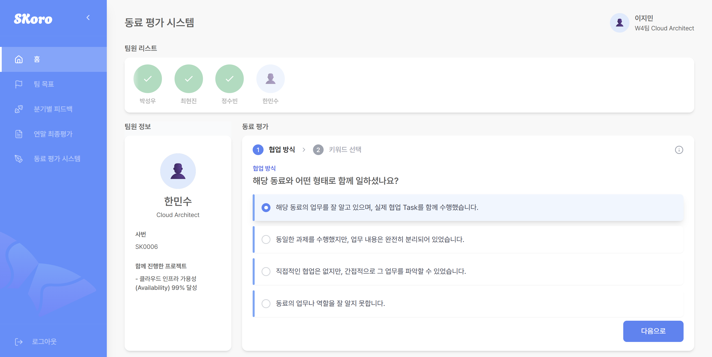

# SKoro

### "AI 기반 성과 평가 시스템"
> AI가 만드는 공정하고 효율적인 성과 평가 시스템

## 🤖 프로젝트 개요

- **팀명**: LUCKALA  
- **프로젝트명**: SKoro (AI 기반 성과 평가 시스템)  
- **기간**: 2025.05.20 - 2025.07.07 (7주)
- **주관 기관**: SK AX AI Leader Academy (SK AX 산하 교육과정)  
- **목표**: 팀원, 팀장, HR의 성과 평가 부담을 줄이고, 공정하고 투명한 평가를 위해 AI 기반 자동화 시스템을 개발

## 💡 핵심 가치

- 신뢰성 있는 평가: AI를 기반으로 팀원의 노력과 기여도를 객관적으로 파악하여 공정한 성과 평가를 제공합니다. 
- 성장 지향적 시스템: 평가의 수용성과 투명성을 높여 개인과 팀의 지속적인 성장을 지원합니다. 
- Human-in-the-Loop: 완전 자동이 아닌 '협업형 시스템'으로, AI가 복잡한 의존성을 처리하고 핵심적인 의사결정 순간에는 팀장의 판단이 개입됩니다. 

## 🌟 프로젝트 특장점

1. **성과 평가 자동화**

   - 10개 이상의 AI Agent가 평가 전 과정을 자동 수행
   - 업무, 협업, 동료 평가, 정성 평가까지 통합 분석

2. **멀티 에이전트 기반 분석**

   - 업적 평가, 협업 분석, Peer Talk 요약 등 역할별 특화 Agent 구성
   - 평가 편향을 줄이고 객관적인 시각 확보

3. **맞춤형 평가 및 피드백**
   - CL, 직무, 과거 성과를 반영한 개인화된 KPI 및 피드백 제공
   - 프롬프트 기반으로 4P 정성 평가 기준 커스터마이징 가능

## 🎯 타겟 사용자

1. 🧑 팀원: 자신의 노력을 팀장에게 객관적으로 인정받고, 주관적인 평가 없이 공정하게 평가받기를 원하는 사용자
2. 🧑‍💼 팀장: 팀원 업무를 일일이 파악하는 데 어려움을 겪으며, 평가에 많은 시간을 소요하는 사용자
3. 🏢 HR: 새로운 평가 제도를 도입해도 구성원의 수용성이 낮아 어려움을 겪는 사용자

## 📊 주요 기능 요약

- **성과 요약 및 분석**: 개인/팀의 Task, KPI 기반 성과 자동 분석
- **4P 기반 정성 평가**: SK 4P 역량을 기준으로 행동 Anchored 방식(BARS)으로 평가, 프롬프트를 통해 조직 맞춤형 평가 기준으로 수정이 가능
- **동료 평가 요약**: Peer Talk 데이터를 분석해 팀원의 강점과 개선 필요 영역 도출
- **AI 코멘트 제공**: 팀장이 하향 평가 시 활용할 수 있도록 팀원별 평가 및 코멘트 초안 자동 생성
- **분기/연말 레포트 자동화**: 점수, 평가 근거, 피드백 코멘트가 포함된 레포트를 AI가 자동 생성하고 PDF로 다운로드 가능
- **이의제기 및 챗봇 기능**: 평가 결과에 대한 질의응답 챗봇과 감정 케어를 위한 마음케어 챗봇 제공
- **팀장 피드백 전달 지원**: 팀원이 요청 시 챗봇과의 대화 내용을 정제하여 팀장에게 익명 피드백으로 전달

## 🧠 주요 AI Agent 모듈 구성

1. **업적 평가 Agent**: Task 달성률 기반 성과 분석
2. **동료 평가 Agent**: 키워드 기반 협업 피드백 요약
3. **협업 분석 Agent**: 협업 네트워크 자동 분석
4. **정성 평가 Agent (4P)**: 행동 anchored 기준의 BARS 적용
5. **종합 평가 Agent**: 업적+정성 점수를 CL별로 통합 정규화
6. **유사 팀 분석 Agent**: KPI 유사도 기반 팀 벤치마킹
7. **CL 정규화 Agent**: 본부별 성과 분포 조정 및 타당성 분석
8. **개인 성장 코칭 Agent**: 보완 영역 및 코칭 전략 제시
9. **팀 운영 전략 Agent**: 팀 리스크 분석 및 운영 전략 도출
10. **레포트 생성 Agent**: 문체 교정, 길이 조정된 고품질 레포트 생성

## 📱 화면

#### 📌 로그인 

---

### 🧑 팀원

#### 📌 홈  

#### 📌 팀 목표

#### 📌 팀 목표 상세 보기

#### 📌 분기별 피드백 레포트

#### 📌 최종 평가 레포트

<a href="./assets/이지민_2025년도_최종_평가.pdf" target="_blank">👉 📄 최종 평가 레포트 확인</a>

#### 📌 동료 평가 협업 선택 

#### 📌 동료 평가 키워드 선택

#### 📌 동료 평가 완료  

#### 📌 챗봇 선택 

#### 📌 챗봇 선택 - 팀장님께 이야기

#### 📌 챗봇 선택 - 팀장님께 이야기 - 요약하기
- 대화 내용 요약 초안 제공

#### 📌 챗봇 선택 - 팀장님께 이야기 - 요약하기
- 팀원이 직접 수정 후 최종 제출 가능

---

### 🧑‍💼 팀장

#### 📌 홈

#### 📌 팀 목표  

#### 📌 팀 목표 상세 보기

#### 📌 팀 관리 

#### 📌 팀원 레포트  

#### 📌 팀 피드백 레포트  

<a href="./assets/김도현_2025년도_분기_평가.pdf" target="_blank">👉 팀 피드백 레포트 확인</a>

#### 📌 팀 최종 평가 레포트

<a href="./assets/김도현_2025년도_최종_평가.pdf)" target="_blank">👉 팀 최종 평가 레포트 확인</a>

#### 📌 최종 평가 시스템  

#### 📌 팀원 의견 요약  

<a href="./assets/김도현_2025년도_팀원의견요약.pdf)" target="_blank">👉 팀원 의견 요약 확인</a>

---

### 🏢 관리자

#### 📌 홈

#### 📌 평가 로직(프롬프트) 수정  

## 🛠 기술 스택

### Frontend

 
  
  
  
  
  
  
  
  
  

### Backend

  
  
  
  
  
  
  
  

### AI

  
  
  
  
  
  
  
  
  

### Infrastructure

  
  
  
  
  
  
  

## 🧱 시스템 아키텍처

## 🗄️ ERD

## 📦 GitHub 레포지토리 구조

본 프로젝트는 SKALA-10 GitHub Organization에 구성된 멀티 레포지토리 구조로 관리되었습니다.

| 레포지토리 이름   | 설명                       |
|------------------|----------------------------|
| SKoro-Frontend   | 사용자 화면 및 프론트 로직 |
| SKoro-Backend    | API 서버 및 비즈니스 로직  |
| SKoro-AI         | AI 및 FastAPI   |
| SKoro-Infra      | CI/CD 및 인프라 설정       |

## 👤 팀 구성

| 분야     | 인원             | 팀원 |
| -------- | ---------------- | ---- |
| AI       | 3명              | 손지영(팀장), 이지선, 이혜수 |
| Frontend | 1명              | 조은정 |
| Backend  | 2명 (인프라 1명) | 김재현, 신택수 |

## 📅 프로젝트 일정

| 단계       | 작업                         | 기간                          |
| ---------- | ---------------------------- | ----------------------------- |
| **기획**   | 아이디어 및 기능 명세         | 2025-05-20 ~ 2025-05-27 (6일) |
| **설계**   | Figma, ERD, API 명세서      | 2025-05-28 ~ 2025-06-03 (5일) |
| **개발**   | 기능 개발               | 2025-06-04 ~ 2025-06-27 (18일) |
| **마무리** | 통합 테스트 및 산출물 작성 | 2025-06-30 ~ 2025-07-03 (4일) |
|  | 통합 테스트 및 발표준비(UCC, PPT) | 2025-07-04 ~ 2025-07-07 (4일) |
|            | 최종발표                     | 2025-07-08 ~ 2024-07-08 (1일) |

## 📝 프로젝트 후기

### 🐝 김재현

프로젝트는 제때 완성했지만, 시연 영상을 정해진 기한 내에 제출하지 못해 아쉬움이 남습니다.  
SI 기업 특성상 마감 기한을 매우 중요하게 여기기 때문에, 1분 시연 영상이 누락되었을 때 직접 시연해야 할지 고민하기도 했습니다.  
발표 시간이 최대 7분으로 제한되어 있어 직접 시연은 어려웠고, 다행히 제때 제출한 5분짜리 영상을 활용해 넘어갈 수 있었습니다.

이번 경험을 통해 ‘내가 조금만 더 열심히 했더라면 시연 영상을 기한 내에 제출할 수 있었을 텐데’ 하는 아쉬움이 크게 남았습니다.  
주어진 역할은 충실히 수행했지만, **원팀 마인드셋**이라는 관점에서는 부족했다는 반성이 듭니다.  
나의 주도성은 내가 잘 아는 범위에 국한되어 있었고, 프로젝트 전체 흐름에 더 깊이 관여하지 못한 점이 아쉬웠습니다.

특히 제출 기한이 지난 시점에는 솔직히 마음속으로 포기하고 있었는데,  
팀장님은 오히려 누구보다 열심히 준비했음에도 포기하지 않고 바로 회의를 열고 발표 준비를 이어가자고 했습니다.  
그 모습이 정말 멋졌고, ‘저렇게 끝까지 포기하지 않는 사람이 있는데, 나도 더 최선을 다해야겠다’는 자극을 받았습니다.  
다른 팀원들도 각자의 자리에서 열심히 해준 덕분에 발표를 잘 마칠 수 있었고, 결국 5분짜리 시연 영상이라도 보여줄 수 있어 조금은 다행이라는 생각이 들었습니다.

이번 프로젝트는 제가 처음으로 **기한 내 제출을 놓친** 경험이었고, 스스로 많이 돌아보게 되었습니다.  
다음 프로젝트에서는 이러한 부족함을 보완해 더 적극적으로 개발에 참여하고,  
내 분야가 아니더라도 필요하다면 도전하며, 모르는 부분은 함께 고민하는 **원팀 마인드셋을 가진 팀원**으로 성장하고 싶습니다.

## 📦 GitHub 레포지토리

- 💻 **프론트엔드**: [SKoro-Frontend](https://github.com/SKALA-10/SKoro-Frontend)
- 🧪 **백엔드**: [SKoro-Backend](https://github.com/SKALA-10/SKoro-Backend)
- 🤖 **AI**: [SKoro-AI](https://github.com/SKALA-10/SKoro-AI)
- 🔧 **인프라**: [SKoro-Infra](https://github.com/SKALA-10/SKoro-Infra)

## 📹 시연 영상 및 자료

- **발표 자료:** <a href="./docs/LUCKALA_AI_성과_평가_시스템.pdf" target="_blank">LUCKALA: AI 성과 평가 시스템</a>
- **시연 영상(1분):** <a href="./docs/SKoro_1분_시연_영상.mp4" target="_blank">SKoro 1분 시연 영상</a>
- **시연 영상(5분):** <a href="./docs/SKoro_5분_시연_영상.mp4" target="_blank">SKoro 5분 시연 영상</a>
- **배포 링크:** <a href="https://skoro.skala25a.project.skala-ai.com/" target="_blank">SKoro</a> (현재 서비스 종료)

## 📄 산출물 및 설계 자료

- **물리 ERD:** <a href="./docs/LUCKALA_물리ERD_v1.0.docx" target="_blank">LUCKALA_물리ERD_v1.0.docx</a>
- **WBS:** <a href="./docs/LUCKALA_WBS_v1.0.xlsx" target="_blank">LUCKALA_WBS_v1.0.xlsx</a>
- **통합 테스트케이스:** <a href="./docs/LUCKALA_통합테스트케이스(결과)_v1.0.xlsx" target="_blank">LUCKALA_통합테스트케이스(결과)_v1.0.xlsx</a>
- **UI 정의서:** <a href="./docs/LUCKALA_UI정의서_v1.0.pptx" target="_blank">LUCKALA_UI정의서_v1.0.pptx</a>
- **요구사항 정의서:** <a href="./docs/LUCKALA_요구사항정의서_v1.2.xlsx" target="_blank">LUCKALA_요구사항정의서_v1.2.xlsx</a>
- **사업수행 계획서:** <a href="./docs/LUCKALA_사업수행계획서_v1.2.docx" target="_blank">LUCKALA_사업수행계획서_v1.2.docx</a>
- **개발 표준 정의서:** <a href="./docs/LUCKALA_개발표준_정의서_v1.2.docx" target="_blank">LUCKALA_개발표준_정의서_v1.2.docx</a>
- **인터페이스 정의서:** <a href="./docs/LUCKALA_인터페이스정의서_v1.0.xlsx" target="_blank">LUCKALA_인터페이스정의서_v1.0.xlsx</a>

## 📜 License

This project is licensed under the MIT License - see the [LICENSE](LICENSE) file for details.
